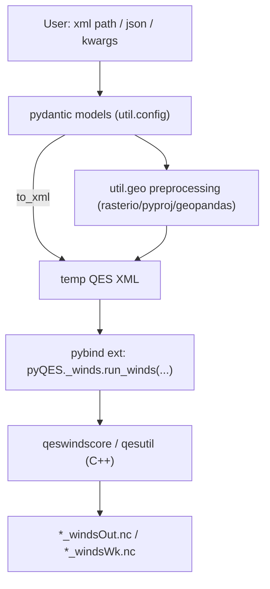

# pyQES — Python wrapper for QES

## Architecture

`pyQES` is a hybrid package: thin **pybind11 C++ bindings** over the existing core libraries (`qesutil`, `qeswindscore`, `qesplumecore`, `qesfirecore`) plus a **pure-Python layer** (pydantic models + geospatial preprocessing). We do NOT bind every C++ class. Instead we add small C++ "runner" functions that replicate each `main()` workflow and bind only those, keeping the binding surface tiny and maintainable.



Import surface: `import pyQES` → `pyQES.pywinds`, `pyQES.pyplume`, `pyQES.pyfire`, `pyQES.util`. Compiled private extensions: `pyQES._winds`, `pyQES._plume`, `pyQES._fire`, `pyQES._util`. Distribution name `pyqes`, import name `pyQES`.

## Layout (all under `src/`, per request)

- `src/pyQES/__init__.py` — re-exports submodules + version.
- `src/pyQES/util/` — `config.py` (base pydantic models + JSON I/O), `xml_io.py` (pydantic ⇄ QES XML), `geo.py` (preprocessing), `paths.py` (locate temp/output dirs).
- `src/pyQES/pywinds/__init__.py` — `WindsParameters`, `SensorParameters`, `run()`.
- `src/pyQES/pyplume/__init__.py` — `PlumeParameters`, `run()`.
- `src/pyQES/pyfire/__init__.py` — `FireParameters`, `run()`.
- `src/pyQES/py.typed` + `.pyi` stubs for the extensions.
- `src/bindings/` — C++: `winds_bindings.cpp`, `plume_bindings.cpp`, `fire_bindings.cpp`, `util_bindings.cpp`, and `runners/` (`run_winds.cpp/.h`, etc. factored from the `qes*Main.cpp` files).

## 1. C++ runner layer + pybind bindings

Factor each `main()` into a reusable runner. Example, `src/bindings/runners/run_winds.h`:

```cpp
struct WindsRunResult { std::string windsOut, windsWk, turbOut; };
WindsRunResult run_winds(const std::string &xmlPath, int solveType,
                         const std::string &outBasename,
                         bool visu, bool wksp, bool turb);
```

Its `.cpp` copies the body of [qesWinds/qesWindsMain.cpp](qesWinds/qesWindsMain.cpp) (parse `WINDSInputData` → `qes::Domain` → `WINDSGeneralData` → `SolverFactory` → solve loop → save), returning output file paths instead of `exit()`. Same for plume (`qesPlumeMain.cpp`) and fire (`qesFireMain.cpp`).

`src/bindings/winds_bindings.cpp` uses `pybind11` to expose `run_winds` and a version string. Bindings release the GIL around the solve (`py::gil_scoped_release`).

## 2. CMake integration

- Root [CMakeLists.txt](CMakeLists.txt): add `option(QES_BUILD_PYTHON "Build pyQES pybind modules" OFF)`. When ON: `find_package(pybind11 CONFIG REQUIRED)`, `add_subdirectory(src/bindings)`, and **skip** `qesWinds/qesPlume/qesFire/qes/examples/tests` subdirs (guard those `add_subdirectory` calls behind `if(NOT QES_BUILD_PYTHON)`), so wheels build only core libs + bindings.
- New `src/bindings/CMakeLists.txt`: one `pybind11_add_module(_winds runners/run_winds.cpp winds_bindings.cpp)` per module, each `target_link_libraries(... PRIVATE qeswindscore qesutil)` (+ `qesplumecore`/`qesfirecore` as needed) then `link_external_libraries(_winds)` (reusing the existing helper for Boost/GDAL/NetCDF). Install into the wheel via `install(TARGETS _winds LIBRARY DESTINATION pyQES)`.
- Build core libs as position-independent (`set(CMAKE_POSITION_INDEPENDENT_CODE ON)` under the python build path).
- CUDA/OptiX stay auto-off in CI (no toolkit on runners), so only CPU cores compile — matching `run_qeswinds_cpu.sh` behavior.

## 3. Python: pydantic/dataclass config + XML/JSON I/O

- `util/config.py`: Pydantic v2 models mirroring the XML in [umep_larochelle.xml](data/umep_workflow/qes/umep_larochelle.xml): `SimulationParameters` (dem, halo_x/y, domain=(nx,ny,nz), cell_size=(dx,dy,dz), all `*Flag` fields, maxIterations, tolerance, domainRotation, origin fields), `MetParams`, `BuildingsParams`, `TurbParams`, `FileOptions`, and `SensorParameters` (from [sensor_umep.xml](data/umep_workflow/qes/sensor_umep.xml)). `WindsParameters` aggregates them. `model_config = ConfigDict(populate_by_name=True)`; JSON via pydantic's `model_dump_json` / `model_validate_json`.
- `util/xml_io.py`: `to_qes_xml(params) -> str` and `from_qes_xml(path) -> WindsParameters` using `xml.etree.ElementTree` (matching the exact QES tag layout the C++ parser expects).

## 4. Python: preprocessing (reimplement bash in Python)

`util/geo.py` — port every function from [run_qeswinds.sh](data/umep_workflow/run_qeswinds.sh) using rasterio/pyproj/geopandas (no CLI):

- `compute_domain_origin_from_dem(dem) -> Origin(utmx, utmy, utm_zone, utm_letter)` — rasterio bounds SW corner + pyproj transform to EPSG:4326 + UTM zone/band math (mirrors the embedded python in the script).
- `get_dem_srs(dem)` (rasterio CRS), `compute_domain_cells(params, dem, shp, z_margin) -> (nx, ny, nz)` (raster size + halo + `cellSize`; max building height from shapefile via geopandas + DEM max), `compute_sensor_north_qes_coords(dem, dist_x, dist_y) -> (site_x, site_y)`.
- `prepare_buildings_clipped(dem, src, mask, out)` — geopandas reproject to DEM CRS + clip to mask, write shapefile layer `buildings_clipped`.
- `check_domain_rotation(params)` — raise if `domainRotation != 0` (same guard as the script).

## 5. Python: run() entrypoints

`pywinds/run()` signature (mirrors CLI flags `-q -s -w -o` from [handleWINDSArgs.h](qesWinds/handleWINDSArgs.h)):

```python
def run(config=None, *, xml=None, json=None, solver="cpu",
        out_basename="qes", winds_out=True, workspace=True, turb=False,
        auto_preprocess=True, work_dir=None, **overrides) -> WindsRunResult
```

Resolution order: explicit `xml` path used directly; else `json`/`config`/`overrides` → `WindsParameters`; if `auto_preprocess`, run geo steps (origin, cells, sensor site, buildings clip) and patch the model; serialize to a temp XML in `work_dir`; call `pyQES._winds.run_winds(...)`; return dataclass with output NetCDF paths. `solver` maps `"cpu"`→1, `"gpu"`→2. Analogous `pyplume.run()` / `pyfire.run()`.

## 6. Packaging (uv + scikit-build-core)

- `pyproject.toml` (repo root): `build-backend = "scikit_build_core.build"`, `requires = ["scikit-build-core>=0.10", "pybind11>=2.12"]`. `[project]` name `pyqes`, dynamic version, deps: `pydantic>=2`, `numpy`, `rasterio`, `pyproj`, `geopandas`, `netCDF4`. `[tool.scikit-build]` sets `cmake.args = ["-DQES_BUILD_PYTHON=ON"]`, `wheel.packages = ["src/pyQES"]`, `cmake.source-dir = "."`.
- `[tool.uv]` + `[dependency-groups] dev = ["pytest", "ruff", "mypy", "pytest-cov"]`. Document `uv sync`, `uv run pytest`.

## 7. Tests (`tests/python/`)

- `test_geo.py` — unit tests for `compute_domain_origin_from_dem`, `compute_domain_cells`, sensor coords against the small rasters in `data/umep_workflow/` (`DEM_flat_zero.tif`), asserting values match the current bash outputs.
- `test_xml_io.py` — round-trip pydantic ⇄ XML equals the committed `umep_larochelle.xml` semantics.
- `test_config.py` — JSON (de)serialization and validation errors.
- `test_run_winds.py` — integration: `pywinds.run(...)` on the La Rochelle case, marked `@pytest.mark.slow` (skipped if extension not built).

## 8. GitHub Actions

- `.github/workflows/ci.yml` — on push/PR: `uv sync`, `ruff`, `mypy`, `pytest -m "not slow"` (Linux).
- `.github/workflows/wheels.yml` — `cibuildwheel` matrix `ubuntu-latest / macos-latest / windows-latest`. Native deps via **vcpkg** (`gdal`, `netcdf-cxx4`, `boost-program-options`, `boost-date-time`, `pybind11`) with `CMAKE_TOOLCHAIN_FILE` exported in `CIBW_ENVIRONMENT`; `cibuildwheel` auto-runs auditwheel/delocate/delvewheel to bundle the shared libs. Skip musllinux/PyPy/CUDA. Build sdist too. Upload artifacts.
- `.github/workflows/publish.yml` — on `v*` tag: download wheel+sdist artifacts, publish via `pypa/gh-action-pypi-publish` using PyPI Trusted Publishing (OIDC, no stored token).

## Notes / assumptions

- pybind runners avoid binding the large class hierarchy; they wrap the proven `main()` workflows.
- Wheels are CPU-only (CUDA runners unavailable in standard CI); GPU stays available via a from-source build.
- vcpkg is the cross-platform dependency strategy since manylinux lacks GDAL/NetCDF/Boost; first green Linux wheel is the riskiest step and will be validated first.