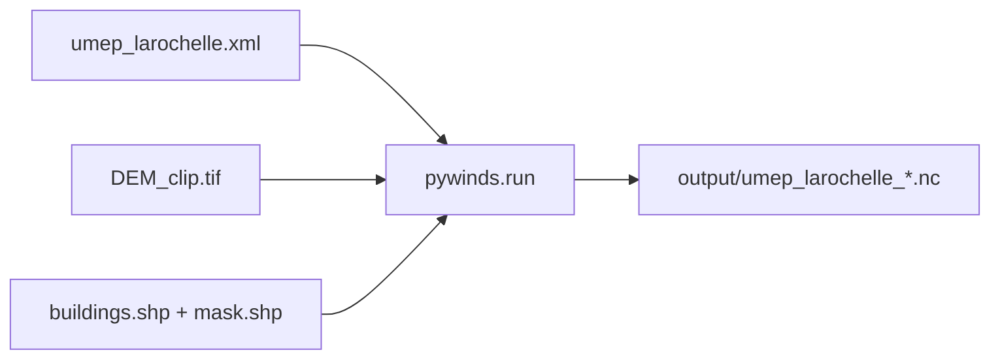

# Exemple Python umep_workflow (qesWinds)

## Contexte

Les wrappers bash ([`run_qeswinds.sh`](data/umep_workflow/run_qeswinds.sh), `_cpu`, `_gpu`) préparent DEM/bâtiments/sensor puis appellent le binaire `qesWinds`. L’API Python correspondante est déjà dans [`src/pyQES/pywinds/__init__.py`](src/pyQES/pywinds/__init__.py) (`pywinds.run`).

Points d’attention sur les assets :
- Le XML pointe vers `../DEM.tif` (**absent**) ; disponibles : `DEM_clip.tif`, `DEM_flat.tif`, `DEM_flat_zero.tif`.
- Commentaire XML : cas La Rochelle = **DEM_clip** + `buildings_clipped.shp`.
- Source bâtiments par défaut du bash (`batiments_urock_0.shp`) absente ; utiliser `buildings.shp` + `mask.shp` (présents).

## Approche

Créer **un seul fichier** [`data/umep_workflow/run_qeswinds.py`](data/umep_workflow/run_qeswinds.py) exécutable, miroir Python de `run_qeswinds.sh` :



Comportement :
1. Résoudre les chemins relatifs au dossier du script (`HERE = Path(__file__).resolve().parent`).
2. Appeler `pywinds.run(xml=..., dem=..., buildings_src=..., buildings_mask=..., auto_preprocess=True, work_dir=HERE/"output", out_basename="umep_larochelle", solver=..., winds_out=True, workspace=True)`.
3. Afficher les chemins NetCDF retournés (`result.winds_out`, `result.winds_wk`).

CLI (`argparse`) alignée sur les bash :
- `--solver {cpu,gpu}` (défaut `cpu`)
- `--dem` (défaut `DEM_clip.tif` à côté du script)
- `--no-preprocess` → `auto_preprocess=False` (réutilise domain/origin/bâtiments déjà dans le XML / `qes/`)
- `--buildings-src` / `--buildings-mask` (défauts `buildings.shp` / `mask.shp`)

Guards en tête : vérifier existence du XML et du DEM ; message clair si `pyQES` / extension native manquants (`ImportError` → indiquer `uv sync` depuis la racine du repo).

Ne pas modifier le XML, les bash, ni le package `pyQES`. Pas de nouveau test pytest (c’est un exemple data/, pas une suite).

## Usage attendu

```bash
# depuis la racine du repo, après uv sync
uv run python data/umep_workflow/run_qeswinds.py
uv run python data/umep_workflow/run_qeswinds.py --solver cpu --dem DEM_flat.tif
```

## Fichier livré

- [`data/umep_workflow/run_qeswinds.py`](data/umep_workflow/run_qeswinds.py) — ~60–80 lignes, `main()`, docstring d’usage en tête.